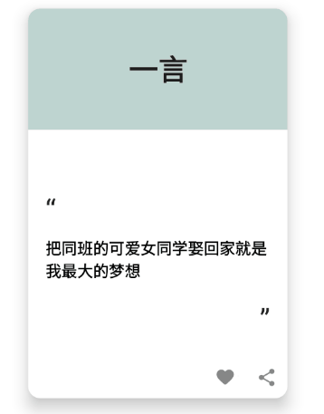

`IconButton` 可以帮助我们生成一个可点击的图标按钮

`IconButton` 是一个可点击的图标，用于表示动作（复制，粘贴，保存，等等）。`IconButton` 的整体最小触摸目标尺寸为 **48 x 48dp**，以满足无障碍准则。`content` 会在 `IconButton` 内居中。

这个组件通常用于应用栏内的导航图标/动作。

`content` 通常应该是一个图标，使用 `androidx.compose.material.icons.Icons` 中的一个图标。如果使用自定义图标，请注意内部图标的典型尺寸是 **24 x 24 dp**。


``` kotlin
@Composable
fun IconButtonDemo() {

    Row{
        IconButton(onClick = { /*TODO*/ }) {
            Icon(Icons.Filled.Search, null)
        }
        IconButton(onClick = { /*TODO*/ }) {
            Icon(Icons.Filled.ArrowBack, null)
        }
        IconButton(onClick = { /*TODO*/ }) {
            Icon(Icons.Filled.Done, null)
        }
    }
    
}
```


## 1. 取消波纹

有些时候我们想要取消按钮点击所产生的波纹要怎么办？

`IconButton` 的源码中其实将 `Box` 里的 `modifier.clickable` 参数 `Indication` 设置成波纹了

``` kotlin
@Composable
fun IconButton(
    onClick: () -> Unit,
    modifier: Modifier = Modifier,
    enabled: Boolean = true,
    interactionSource: MutableInteractionSource = remember { MutableInteractionSource() },
    content: @Composable () -> Unit
) {
    Box(
        modifier = modifier
            .clickable(
                onClick = onClick,
                enabled = enabled,
                role = Role.Button,
                interactionSource = interactionSource,
                indication = rememberRipple(bounded = false, radius = RippleRadius)
            )
            .then(IconButtonSizeModifier),
        contentAlignment = Alignment.Center
    ) { content() }
}

```

那我们只需要复制源码的代码添加到自己的项目中，并且将 `indication` 设置为 `null` 就好了

``` kotlin
@Composable
fun MyIconButton(
    onClick: () -> Unit,
    modifier: Modifier = Modifier,
    enabled: Boolean = true,
    interactionSource: MutableInteractionSource = remember { MutableInteractionSource() },
    content: @Composable () -> Unit
) {
    // 这也是源码的一部分
    val IconButtonSizeModifier = Modifier.size(48.dp)
    Box(
        modifier = modifier
            .clickable(
                onClick = onClick,
                enabled = enabled,
                role = Role.Button,
                interactionSource = interactionSource,
                indication = null
            )
            .then(IconButtonSizeModifier),
        contentAlignment = Alignment.Center
    ) { content() }
}
```

