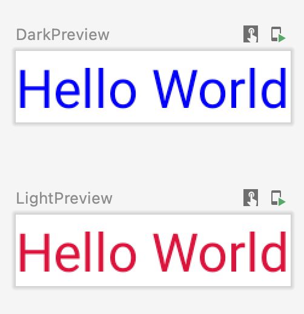

## 1. 介绍

**MaterialTheme**  是 Jetpack Compose 所提供的基于 Material Design 风格主题样式模版，通过主题样式模版的配置，允许自定义视图系统中所有组件根据主题切换而相应得到样式改变。

当创建一个新的 Compose 项目时，Android Studio 会默认帮我生成一个 Theme 方法(生成的命名规则：项目名称+Theme)

```kotlin
class MainActivity : ComponentActivity() {
    override fun onCreate(savedInstanceState: Bundle?) {
        super.onCreate(savedInstanceState)
        setContent {
            // 看这里，我创建的项目名称是 ComposeStudy ～
            // 值得注意的是我们声明的自定义视图会以 lambda 参数形式传入其中。
            ComposeStudyTheme {  
               Surface(color = MaterialTheme.colors.background) {
                    Greeting("Android")
                }
            }
        }
    }
}
```

接下来，我们看看这个生成的 Theme 方法为我们做了哪些事。

```kotlin
@Composable
fun ComposeStudyTheme(
    darkTheme: Boolean = isSystemInDarkTheme(),
    content: @Composable() () -> Unit
) {
    val colors = if (darkTheme) {
        DarkColorPalette
    } else {
        LightColorPalette
    }
    MaterialTheme(
        colors = colors, // 颜色
        typography = Typography, // 字体
        shapes = Shapes, // 形状
        content = content // 声明的视图
    )
}
private val DarkColorPalette = darkColors(
    primary = Purple200,
    primaryVariant = Purple700,
    secondary = Teal200
)
private val LightColorPalette = lightColors(
    primary = Purple500,
    primaryVariant = Purple700,
    secondary = Teal200
)
```

在这里我们看到了 **MaterialTheme** 。但是先别急我们往上看看，可以看到 Android Studio 默认帮助我们生成了两种配色的调色板( Light 与 Dark )，根据传入布尔值的不同而选择其一，并将其传入到MaterialTheme。可以看到这两种配色的调色板分别使用的是 <code>darkColors</code> 与 <code>lightColors</code> 两个方法的返回值，我们看看这两者的实现。

```kotlin
fun lightColors(
    primary: Color = Color(0xFF6200EE),
    primaryVariant: Color = Color(0xFF3700B3),
    secondary: Color = Color(0xFF03DAC6),
    secondaryVariant: Color = Color(0xFF018786),
    background: Color = Color.White,
    surface: Color = Color.White,
    error: Color = Color(0xFFB00020),
    onPrimary: Color = Color.White,
    onSecondary: Color = Color.Black,
    onBackground: Color = Color.Black,
    onSurface: Color = Color.Black,
    onError: Color = Color.White
): Colors = Colors(
    primary,
    primaryVariant,
    secondary,
    secondaryVariant,
    background,
    surface,
    error,
    onPrimary,
    onSecondary,
    onBackground,
    onSurface,
    onError,
    true
)
```

可以看到 <code>lightColors</code> 将传入参数透传到了Colors构造器中了，而 Colors 构造器属性是没有默认值的，<code>lightColors</code> 帮助我们生成了许多属性默认值。可以发现两种调色板本质上只是Colors成员属性配置的不同，懂得了本质就可以进行定制主题样式的配置了。

## **2. 简单使用 MaterialTheme 完成主题配色**

接下来是使用示例，假设当前需求为根据主题的不同使得我们定制的文本颜色也会随之变化。当亮色主题时显示为红色，暗色主题显示为蓝色。这里我们使用 Color 的 primary 属性来存储，当然也可以使用其他成员属性。

```kotlin
@Composable
fun CustomColorTheme(
    isDark: Boolean,
    content: @Composable() () -> Unit
) {
    var BLUE = Color(0xFF0000FF) 
    var RED = Color(0xFFDC143C)
    val colors = if (isDark) {
        darkColors(primary = BLUE) // 将 primary 设置为蓝色
    } else {
        lightColors(primary = RED) // 将 primary 设置为红色
    }
    MaterialTheme(
        colors = colors,
        typography = Typography,
        shapes = Shapes,
        content = content
    )
}
```

配置完就可以在我们的自定义视图系统中使用了，将我们视图中的 `Text` 颜色配置为 <code >MaterialTheme.colors.primary</code> 。

```kotlin
@Composable
fun SampleText() {
    Text(
        text = "Hello World",
        color = MaterialTheme.colors.primary
    )
}
@Preview(showBackground = true)
@Composable
fun DarkPreview() {
    CustomColorTheme(isDark = true) {
        SampleText();
    }
}
@Preview(showBackground = true)
@Composable
fun LightPreview() {
    CustomColorTheme(isDark = false) {
        SampleText()
    }
}
```

我们同时创建了两种主题的预览，通过 Android Studio 的 Preview 窗口就可以预览到所有主题下的效果了。

 

